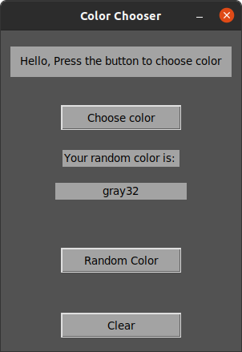

# Color Generator
A simple GUI tool to generate colors.
* Choose color of your choice and get its Hex code.
* Generate a random color.
  
## Prerequisites
You only need Python to run this script. You can visit [here](https://www.python.org/downloads/) to download Python.  
**Or** you can simply use any Python online compiler.

## How to run the app?
* Running the app is really simple! Just open a terminal in the folder where your script is located and run the following command :

```
python3 color_generator.py
```

## Screenshot showing the sample use of the app
  

## Author Name
[Mhmd Ali Hsen](https://github.com/mhmdali102)
