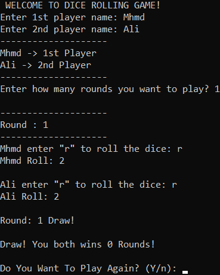

# Dice rolling game
 A simple terminal based game fun-to-play for two players.

## Prerequisites
You only need Python to run this script. You can visit [here](https://www.python.org/downloads/) to download Python.  
**Or** you can simply use any Python online compiler.  

## How to run the game?
* Running the game is really simple! Just open a terminal in the folder where your script is located and run the following command :

```
dice_rolling_simulator.py
```

## Screenshot showing the sample use of the game
  

## Author Name
[Mhmd Ali Hsen](https://github.com/mhmdali102)