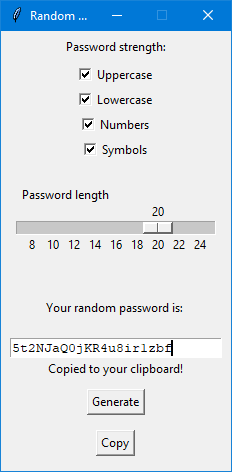

# GUI random password generator
A simple GUI tool to generate random passwords.
* Generate a random password with different strength.
* Generate a random password with custom length.
* Generate a non duplicate characters.
  
## Prerequisites
You only need Python to run this script. You can visit [here](https://www.python.org/downloads/) to download Python.  
**Or** you can simply use any Python online compiler.

## How to run the app?
* Running the app is really simple! Just open a terminal in the folder where your script is located and run the following command :

```
python password_generator.py
```

**Or**  

* Install and open the `.exe` file

> Note: Disable real-time protection to be able to run the app.
### How to turn off real-time protection?
*Follow this path: (Windows 10)*  
Settings/ Update and security/ Windows Security/ Virus and thread protection/ Manage settings/ Turn off
  
## Screenshot showing the sample use of the app
  
## Author Name
[Mhmd Ali Hsen](https://github.com/mhmdali102)
