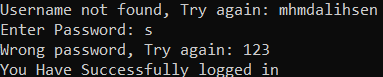

# Login System
 A simple terminal based login system using python.

## Prerequisites
You only need Python to run this script. You can visit [here](https://www.python.org/downloads/) to download Python.  
**Or** you can simply use any Python online compiler.

## How to run it?
* Running the script is really simple! Just open a terminal in the folder where your script is located and run the following command :

```
python login_system.py
```
## Screenshot showing the sample use of the Script
  

## Author Name
[Mhmd Ali Hsen](https://github.com/mhmdali102)