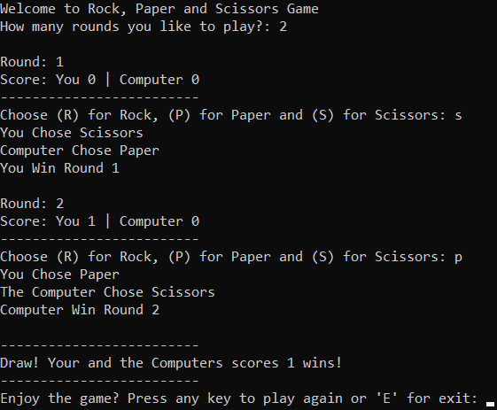

# Rock Paper Scissors
 A simple terminal based fun-to-play game against the computer.
 * You can choose the number of rounds for every game.
 * The score is displayed after every round.  
 
## Prerequisites
You only need Python to run this script. You can visit [here](https://www.python.org/downloads/) to download Python.  
**Or** you can simply use any Python online compiler.  

## How to run the game?
* Running the game is really simple! Just open a terminal in the folder where your script is located and run the following command :

```
python rock_paper_scissors.py
```  
## Screenshot showing the sample use of the game
  

## Author Name
[Mhmd Ali Hsen](https://github.com/mhmdali102)