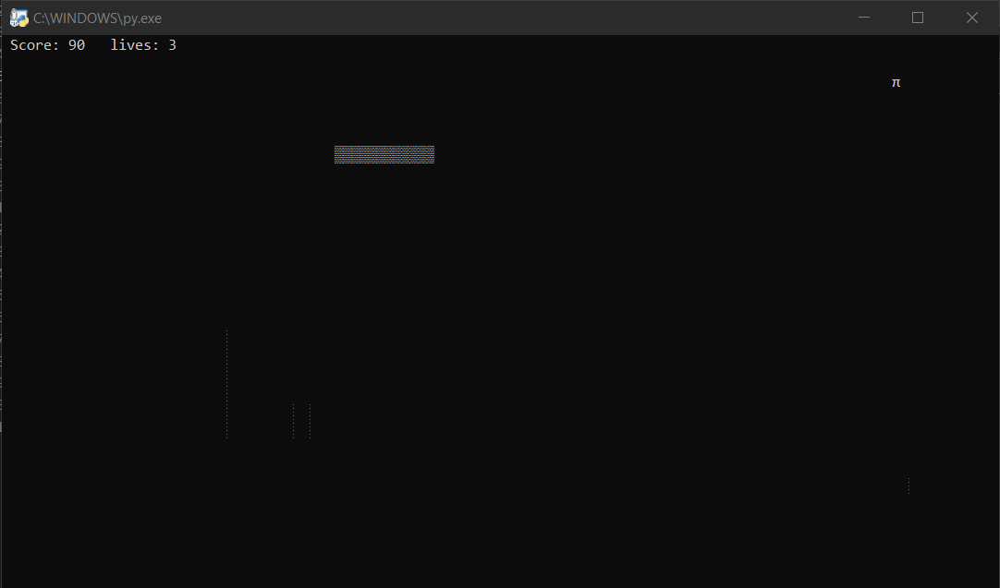

# Snake Game
The classic snake game, Made with python.
* You have 3 lives, try not to loose them and enjoy the game.
* A score window is displayed with 10 points for one food.
* The score will reset for every live, to monitor your progress

## Prerequisites
You need Python 3.X and windows-curses module installed in your machine to run this game.
* To download Python, you can visit [here](https://www.python.org/downloads/). 
* To download windows-curses module, you can visit [here](https://pypi.org/project/windows-curses/)  
    **Or**  
    You can easly download the `requirements.txt` file and run the following command in a terminal :
    ```pip3 install -r requirements.txt```

## How to run the game?
* Running the game is really simple! Just open a terminal in the folder where your script is located and run the following command :
    ```
    python snake_game.py
    ```  

## Screenshot showing the sample use of the game
  

## Author Name
[Mhmd Ali Hsen](https://github.com/mhmdali102)