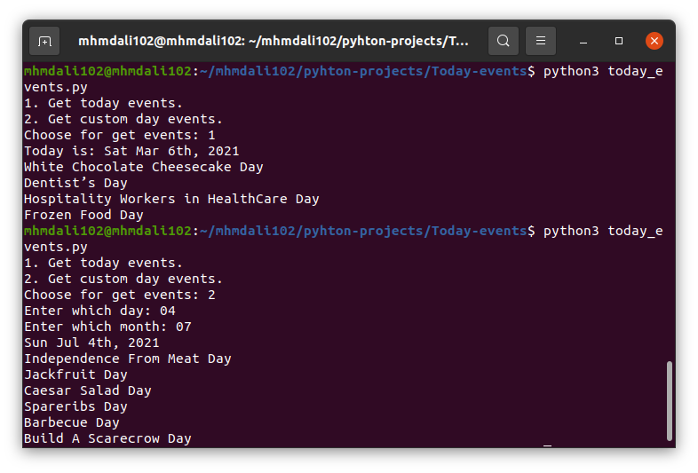

# Today Events
A terminal based script to get events of the days.
* Get the events for the current day automatically.
* Get the events for a custom day.
> *Note:* You have to enter the zero if the day/month is one digit. (see example in the screenshot below)

## Prerequisites
You need Python 3.X and some modules installed in your machine to run this script.
* To download Python, you can visit [here](https://www.python.org/downloads/). 
* You can easly download the `requirements.txt` file and run the following command in a terminal :
  ```pip3 install -r requirements.txt```

* **Or** you can simply use any Python online compiler.

## How to run the script?

* Running the script is really simple! Just open a terminal in the folder where your script is located and run the following command :

    ```
    python today_events.py
    ```  


## Screenshot showing the sample use of the script
  

## Author Name
[Mhmd Ali Hsen](https://github.com/mhmdali102)