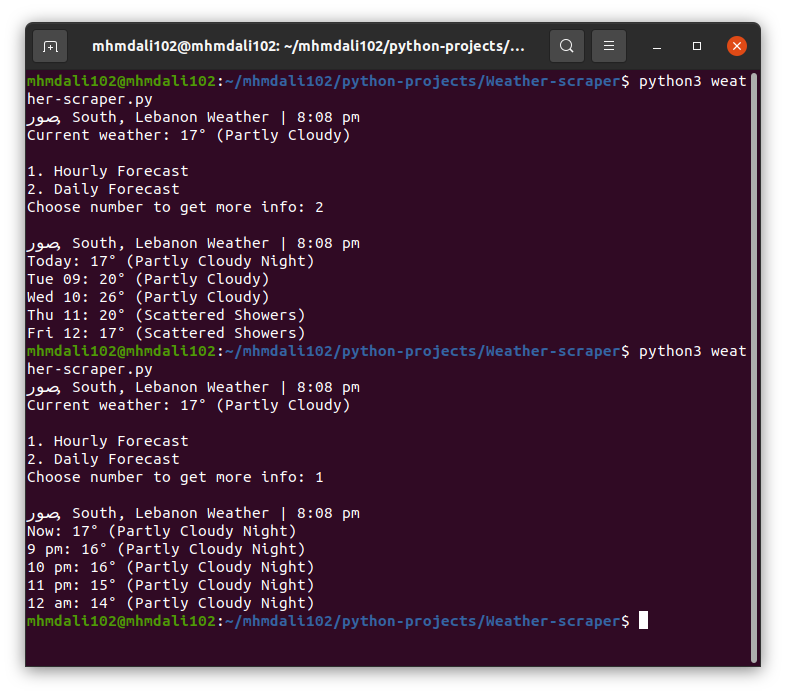

# Weather scraper
Script to get the weather status.
* Get the current weather status with the temperature for your city automatically.
* Get the weather hourly forecast for your city.
* Get the weather daily forecast for your city. 

## Prerequisites
You need Python 3.X and some modules installed in your machine to run this script.
* To download Python, you can visit [here](https://www.python.org/downloads/). 
* You can easly download the `requirements.txt` file and run the following command in a terminal :
  ```pip3 install -r requirements.txt```

**Or** you can simply use any Python online compiler.

## How to run the script?

* Running the script is really simple! Just open a terminal in the folder where your script is located and run the following command :

    ```
    python3 weather_app.py
    ```  

## Screenshot showing the sample use of the script
  

## Author Name
[Mhmd Ali Hsen](https://github.com/mhmdali102)